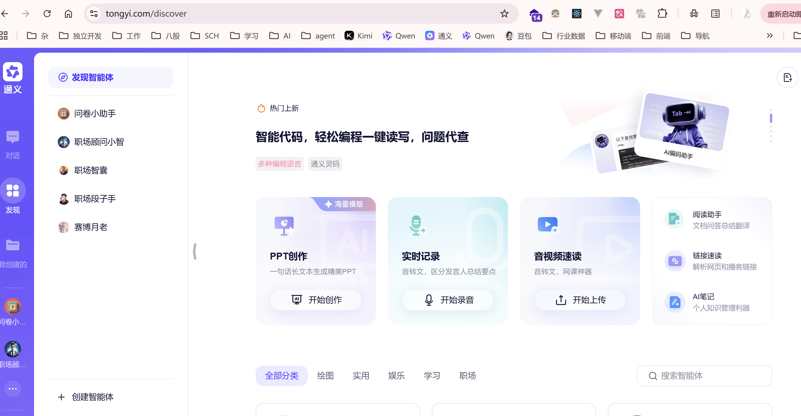

TODO
* 用户知识库，用户可以上传自己的文件，在聊天界面选择是否启用知识库（扩展：可以有多个知识库，选择性启用）
* 选择专项智能体
* 自定义接入模型

* MCP调用，可以自定义/新增MCP并自定义启用 
* 多agent协同
* 友链，ai导航网站
* 对话管理
* 个人用户设置，日/周/月token调用量
* 黑夜白昼主题
* 普罗米修斯、Grafana接入
* SEO优化
* 图片在右下角生成水印

## tips

- 会话可以动态选择agent，也可以动态选择模型
- 

https://mp.weixin.qq.com/s/7cNh7ndeiWiHBjnkTkz_Zg
用户会话级别的消息隔离方案：用户每在前端开启一个新会话，自动生成的会话id传给后端后端根据“用户id:会话id:会话内容”存储到redis
图生文 qwen-vl-plus
文生图 wanx2.1-t2i-plus
深度思考，联网搜索 qwen-plus 
选择图生文或文生图模型后，深度思考和联网搜索功能自动禁用，设为false
参考kimi的分享按钮，生成pdf或链接
apiKey不要直接写到配置文件中，设置idea环境变量
如果用户输入一张照片让仿照画一张，涉及图生文、文生图两个模型的先后调用了，使用任务规划模式，Rect

# 踩坑
* thinking模式下仅支持流式输出，意味着需要使用streamChatModel,如果使用chatModel就算开启了enableThinking、support-incremental-output也无用.
报错：com.alibaba.dashscope.exception.ApiException: {"statusCode":400,"message":"<400> InternalError.Algo.InvalidParameter: The incremental_output parameter must be \"true\" when enable_thinking is true","code":"InvalidParameter","isJson":true}

* https://github.com/langchain4j/langchain4j-community/issues/291
  https://github.com/langchain4j/langchain4j-examples/blob/main/spring-boot-example/src/main/java/dev/langchain4j/example/aiservice/AssistantController.java
  创建service，最好同时指定chatModel和streamChatModel，否则报错java.lang.IllegalArgumentException: chatModel cannot be null或java.lang.IllegalArgumentException: streamingChatModel cannot be null
  如果两者同时指定，那么会根据返回值是String还是FLux<String>来自动选择是否使用流式模型,如下：
  ```java
  AiServices.builder(AiManualService.class)
  .streamingChatModel(streamingChatModel)
  .chatModel(chatModel)
  ```
* 调用大模型报url error, please check url的错误，打断点，看发HTTP请求时的参数，有可能是idea缓存问题
* 同时配置了streamChatModel和chatModel,如果方法返回值是string或Result<List<String>>则使用非流式模型，如果返回值是TokenStream或Flux<String>则是流式模型
* 把图生文、文生图模型开发成tool供模型调用，需要注意，返回值不能是流式的Flux<String>,否则调用失败。正确打开方式如下：
  ```java
  public String chatStr1(String msg) {
      AiServices<AiManualService> aiManualService = AiServices.builder(
            AiManualService.class)
        .chatMemoryProvider(chatMemoryProvider)
        .tools(textGenerateImageTool,imageGenerateTextTool)
        .chatModel(chatModel)
        .streamingChatModel(streamingChatModel);
      return aiManualService.build().chatStr1(msg);
    }
  ```